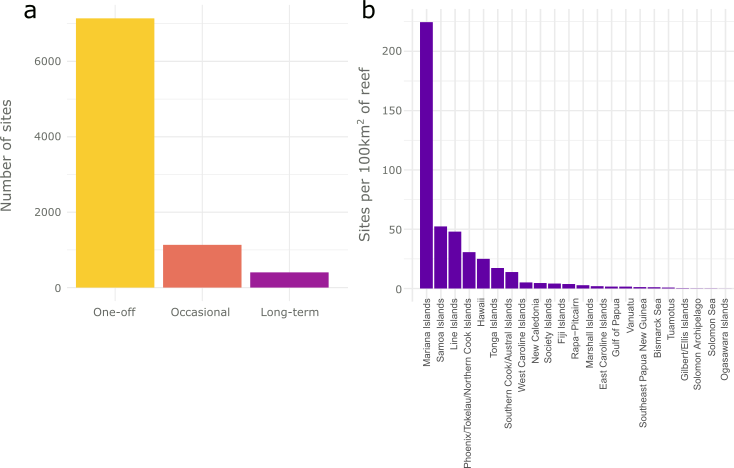
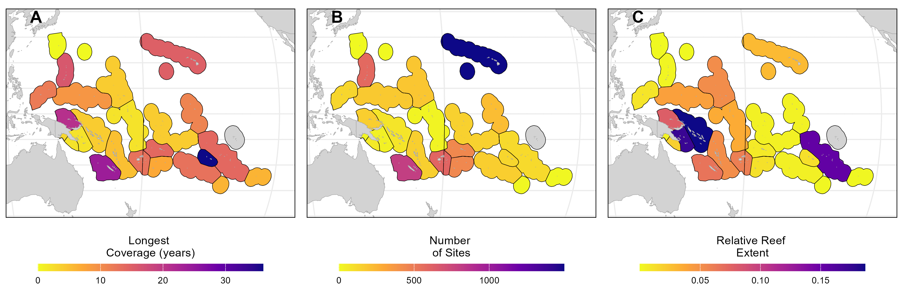
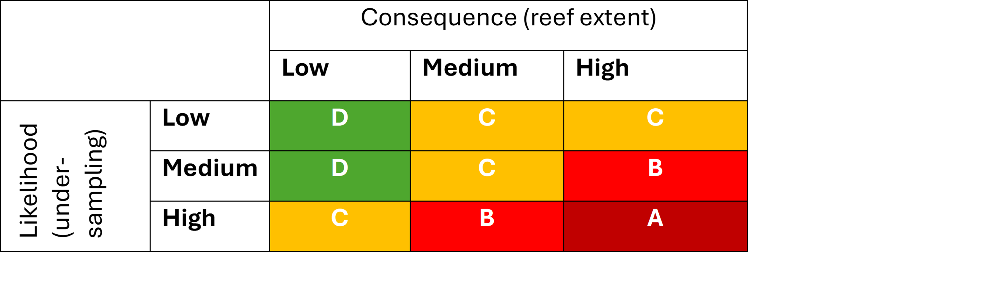
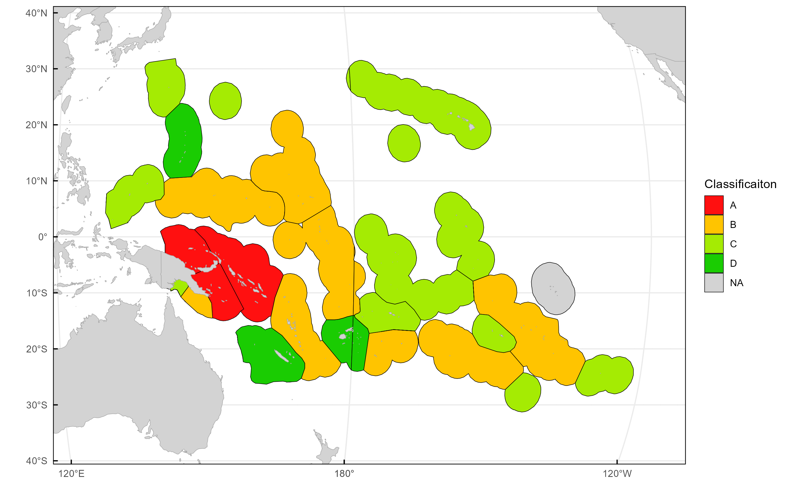

```{r setup, include=FALSE}
knitr::opts_chunk$set(echo = TRUE)
```

# Key messages

### Why is this important?

* Among the world's coral reefs, the Pacific region host the largest proportion of reefs by area. its 65,255 km²
of coral reefs, which represent 26.13% of the world’s coral reefs, reside within 30 economic exclusive zones, corresponding to as many countries and
territories.
* Despite the ecological and socieconomic importance of coral reefs in the Pacific, monitoring coverage is limited and unevenly distributed across the region (Wicquart 2025)

### What did we do?
* Using data collected by the Global Coral Reef Monitoring Network (GCRMN), we analysed the spatial and temporal coverage of monitoring efforts across the Pacific and identified priorities for future monitoring 
to give collective efforts towards a more comprehensive understanding of the status and trends of coral reefs in the region.


### What did we find?
* Overall, we found that monitoring coverage is limited and unevenly distributed, 
with 90% of observations limited to single-year surveys, under-represented ecoregions, 
low spatial coverage with a density of monitoring sites of less than 1 site/100km² and scarce long-term monitoring efforts (< 1% of sites monitored for longer than 10 years).



* Across the Marine Ecoregions of the World (MEOW) ecoregions, we found that monitoring coverage is limited and unevenly distributed, 
with under-represented ecoregions by limited number of sites (A) and short temporal series (B). 
Additionally, ecoregions with the highest reef extent are poorly represented in monitoring efforts (C).


* Using a risk assessment framework, we assessed the consequences and likelihood of underrepresenting Pacific status and trends of coral reefs.


* Based on the risk framework, we identified ecoregions with limited monitoring coverage and high reef extent that could 
hinder the ability to detect changes across the region, and therefore should be prioritised for future monitoring efforts.


* Recognising the increasing frequency and magnitude of climate impacts on coral reefs, we also assessed the potential 
for future bleaching events across the Pacific and identified ecoregions that are projected to 
experience high bleaching frequency by 2050 under a moderate climate change scenario (SSP2-4.5).


### What are the implications of our findings?
* The results highlights that ecoregions with high reef extent, often in low income countries, are poorly represented in monitoring efforts and are projected to experience high bleaching frequency by 2050, which could hinder the ability to detect changes across the 
region and inform management and conservation efforts.

